<div align="center">

# Architecture Overview


STALGIA relies on a strictly linear, request-driven data flow. When a user requests a new track, the system processes it through a series of deterministic steps, isolating prompt expansion, code interpretation, and audio rendering into dedicated modules.

</div>

## Request Lifecycle & Workflow

The following sequence diagram outlines the end-to-end process from the moment a user clicks "Generate" to receiving the final audio payload.

```mermaid
sequenceDiagram
    participant Client as Frontend (UI)
    participant API as Routes API
    participant Gen as Translation Pipeline
    participant Exec as Python Runtime
    participant Audio as Audio Engine

    Client->>API: POST /generate (Prompt + Config)
    API->>Gen: generate_music()
    
    alt User Selects a Prepackaged Example
        Gen->>Gen: Short-circuit LLM calls (Retrieve predefined brief & code)
    else New Generation via LLM
        rect rgb(30, 40, 60)
            Note right of Gen: Pipeline Stage 1
            Gen->>Gen: Expand Prompt into rigid Musical Brief
        end
        
        rect rgb(40, 50, 70)
            Note right of Gen: Pipeline Stage 2
            Gen->>Gen: Translate Brief into pure musicpy Code
        end
    end
    
    Gen->>Exec: execute code via exec()
    alt Syntax / Runtime Error
        Exec-->>Gen: Throw Exception
        Gen->>Gen: Self-Correction Retry (Feed traceback)
        Gen->>Exec: execute corrected code
        
        alt Second Error
            Exec-->>Gen: Throw Exception
            Gen->>Gen: Second Self-Correction Retry
            Gen->>Exec: execute corrected code
        end
    end
    Exec-->>Gen: Return generated 'result' object
    
    Gen->>Gen: Validate & Write object to output.mid
    Gen-->>API: Return JSON (Brief, Code, /download/midi URL)
    API-->>Client: Display Code & trigger audio render
    
    Client-->>API: GET /download/audio?format=mp3 (Background)
    API->>Audio: render_midi_to_audio()
    Audio->>Audio: Process via musicpy.daw + Soundfont (.sf2)
    Audio-->>API: Return BytesIO Stream
    API-->>Client: Stream MP3/WAV file for audio player
```



### Step-by-Step Execution Breakdown

1. **Input Collection:** The frontend (`static/script.js`) collates the user's text prompt, parsing multi-select arrays using `Ctrl/Cmd+Click` (tags like genre, tempo, instruments, key, and mood), into a JSON payload and makes a request to the `/generate` endpoint. It leverages a custom `extractBriefDescription` parser to cleanly strip out markdown code blocks for pure UI presentation.
2. **Translation & Expansion:** The `gemini_service.py` receives the payload. It uses a structured system prompt to form a "Musical Brief"—a detailed blueprint specifying measure counts, motifs, harmony, and instrument behaviors. To ensure tag consistency, the `/tags` endpoint dynamically serves `pretty_midi.constants.INSTRUMENT_MAP` and `DRUM_MAP`, bypassing hardcoded JSON files, guaranteeing instruments requested by the user are grounded in real, addressable synthesizer mapping.
3. **Code Generation / Retrieval:** If the user has selected a Prepackaged Example from the UI, the system short-circuits the LLM and instantly retrieves the predefined brief and code from `prepackaged.py`. For custom prompts, the brief is translated into explicit `musicpy` Python code by the LLM pipeline (`gemini-3.1-pro-preview`). The code generator receives the massive `cheat-sheet.html` injected directly into its system prompt as a primary reference, effectively eliminating syntax hallucination.
4. **Dynamic Execution:** Using an isolated `exec()` environment, the generated Python string is run on the server. This explicitly constructs chords, scales, patterns, and tracks, mapping them to standard GM instrument integers. The backend forces standard Python modulo math to map arpeggiators and strictly forbids the usage of native `.arp()` or unstable `drum()` arrays. 
5. **Retry Mechanism:** Because code generation can occasionally produce syntax errors or unsupported concatenations (like multiplying a `rest()` explicitly by another `rest()`), the execution block intercepts exceptions. If a `ValueError` or `SyntaxError` throws from the Python execution, the traceback is passed back to the translation layer for self-correction. The system attempts 1 initial generation via `gemini-3.1-pro-preview`, and affords up to 2 subsequent fix retries using the faster, lower-temperature `gemini-3.1-flash-lite-preview` model to repair the Python code efficiently.
6. **MIDI Writing:** Once execution succeeds, the generated `result` object is validated and saved as `output.mid`. The frontend receives the brief, the code, and a URL to fetch the MIDI.
7. **DAW Audio Rendering:** Upon receiving the successful generation payload, the frontend background-fetches the `/download/audio` endpoint which invokes `audio_service.py`. The `musicpy.daw` module reads the generated MIDI file and renders it against a defined SoundFont (`.sf2` dynamically located via `pretty_midi.__file__`), exporting a high-quality buffer stream directly back to the client for immediate playback via an HTML5 `<audio>` Player.

## Codebase Structure

```text
STALGIA/
├── app.py                      # Minimal entry point initializing the Flask app.
├── app/                        # Application package logic
│   ├── __init__.py             # App factory and Blueprint registration.
│   ├── config.py               # Environmental variables, models, and SF2 pathing.
│   ├── examples/               # Prepackaged verified generated examples.
│   │   ├── __init__.py
│   │   ├── cheat-sheet.html    # Raw HTML documentation of musicpy for prompt injection.
│   │   └── prepackaged.py      # Hardcoded examples and their matching outputs.
│   ├── prompts/                # Core System Prompts indicating rules and syntax.
│   ├── routes/api.py           # Flask Blueprint exposing endpoints.
│   ├── services/
│   │   ├── gemini_service.py   # Translation Pipeline, Code Gen, and Execution handling.
│   │   └── audio_service.py    # Processes MIDI into MP3/WAV using `daw.export`.
├── docs/                       # Project documentation.
│   ├── api_reference.md        # Available REST endpoints and request/response shapes.
│   ├── architecture.md         # Two-stage generation pipeline and codebase layout.
│   ├── building_with_musicpy.md # How Musicpy syntax works and prompt injection strategies.
│   ├── getting_started.md      # Installation and execution instructions.
│   └── README.md               # Documentation landing page.
├── static/                     # Frontend web elements (HTML, CSS, JS).
├── tags/                       # JSON lists populating UI selection options.
├── tests/                      # Testing suite for API and generation features.
└── requirements.txt            # Python dependencies.
```


## Audio Processing Engine

- `musicpy.daw`: Employs a multi-channel synthesis engine powered by local SoundFonts (such as `TimGM6mb.sf2`).
- Rendering formats scale reliably using `BytesIO`, seamlessly tunneling the compiled song data to the frontend on request.