# Architecture Overview

STALGIA relies on a strictly linear, request-driven data flow. When a user requests a new track, the system processes it through a series of deterministic steps, isolating prompt expansion, code interpretation, and audio rendering into dedicated modules.

## Request Lifecycle & Workflow

The following sequence diagram outlines the end-to-end process from the moment a user clicks "Generate" to receiving the final audio payload.

```mermaid
sequenceDiagram
    participant Client as Frontend (UI)
    participant API as Routes API
    participant Gen as Translation Pipeline
    participant Exec as Python Runtime
    participant Audio as Audio Engine

    Client->>API: POST /generate (Prompt + Config)
    API->>Gen: generate_music()
    
    rect rgb(30, 40, 60)
        Note right of Gen: Pipeline Stage 1
        Gen->>Gen: Expand Prompt into rigid Musical Brief
    end
    
    rect rgb(40, 50, 70)
        Note right of Gen: Pipeline Stage 2
        Gen->>Gen: Translate Brief into pure musicpy Code
    end
    
    Gen->>Exec: execute code via exec()
    alt Syntax / Runtime Error
        Exec-->>Gen: Throw Exception
        Gen->>Gen: Self-Correction Retry (Feed traceback)
        Gen->>Exec: execute corrected code
    end
    Exec-->>Gen: Return generated 'result' object
    
    Gen->>Gen: Validate & Write object to output.mid
    Gen-->>API: Return JSON (Brief, Code, /download/midi URL)
    API-->>Client: Display Code & load MIDI player
    
    Client->>API: GET /download/audio?format=mp3
    API->>Audio: render_midi_to_audio()
    Audio->>Audio: Process via musicpy.daw + Soundfont (.sf2)
    Audio-->>API: Return BytesIO Stream
    API-->>Client: Stream MP3/WAV file download
```



### Step-by-Step Execution Breakdown

1. **Input Collection:** The frontend (`static/script.js`) collates the user's text prompt along with tags like genre, tempo, instruments, key, and mood into a JSON payload and makes a request to the `/generate` endpoint.
2. **Translation & Expansion:** The `gemini_service.py` receives the payload. It uses a structured system prompt to form a "Musical Brief"—a detailed blueprint specifying measure counts, motifs, harmony, and instrument behaviors.
3. **Code Generation:** The brief is then translated into explicit `musicpy` Python code. Rather than guessing black-box audio outputs, the pipeline rigorously focuses on exact MIDI events, chords, rhythms, and track structures.
4. **Dynamic Execution:** Using an isolated `exec()` environment, the generated Python string is run on the server. This explicitly constructs chords, scales, patterns, and tracks, mapping them to standard GM instrument integers. 
5. **Retry Mechanism:** Because code generation can occasionally produce syntax errors or unsupported concatenations, the execution block intercepts exceptions. If a `ValueError` or `SyntaxError` throws from the Python execution, the traceback is passed back to the translation layer for one immediate self-correction attempt.
6. **MIDI Writing:** Once execution succeeds, the generated `result` object is validated and saved as `output.mid`. The frontend receives the brief, the code, and a URL to fetch the MIDI.
7. **DAW Audio Rendering:** When the user decides to download or preview the audio offline, the `/download/audio` endpoint invokes `audio_service.py`. The `musicpy.daw` module reads the generated MIDI file and renders it against a defined SoundFont (`.sf2`), exporting the final high-quality buffer stream directly back to the client.

## Codebase Structure

```text
musicpy/
├── app.py               # Minimal entry point initializing the Flask app.
├── app/                 # Application package logic
│   ├── __init__.py      # App factory and Blueprint registration.
│   ├── config.py        # Environmental variables, models, and SF2 pathing.
│   ├── prompts/         # Core System Prompts indicating rules and syntax.
│   ├── routes/api.py    # Flask Blueprint exposing endpoints.
│   ├── services/
│   │   ├── gemini_service.py # Translation Pipeline, Code Gen, and Execution handling.
│   │   └── audio_service.py  # Processes MIDI into MP3/WAV using `daw.export`.
├── static/              # Frontend web elements (HTML, CSS, JS).
├── tags/                # JSON lists populating UI selection options.
└── docs/                # Project documentation.
```


## Audio Processing Engine

- `musicpy.daw`: Employs a multi-channel synthesis engine powered by local SoundFonts (such as `TimGM6mb.sf2`).
- Rendering formats scale reliably using `BytesIO`, seamlessly tunneling the compiled song data to the frontend on request.